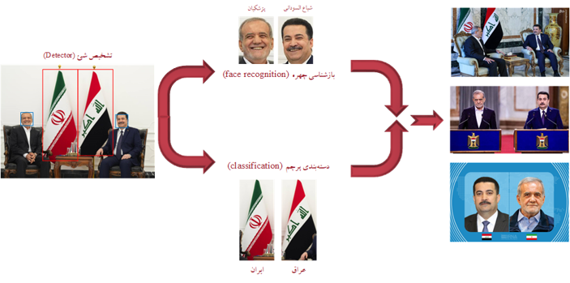
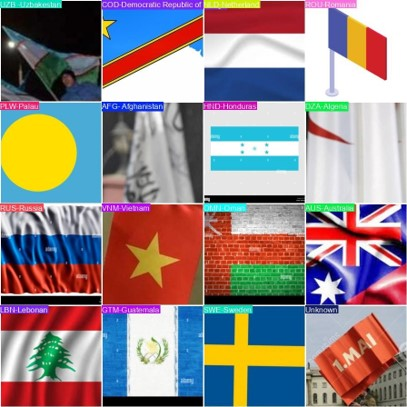

# Image Retrieval using Flags & Faces

In this project, I've implemented an image retrieval system by considering only two entities (face and flag). There are multiple ways to search for similar images which are:

- **text-based**: search using keywords
- **content-based**: extract feature from query image and calculate similarity between database images


Here for simplicity, we just convert the image search problem to a text-based image search  by extracting metadata (flags and faces names within the query image)

The implemented pipeline consist of multiple stage as can be seen below:



- **Detector**: To extract faces and flags from query images
- **Classifier**: determine the country name of a flag
- **Recognition**: using `face-recognition` python package, the identity of faces will be known
- **text-based search**: search for specific keywords extracted from previous stages

## Demo


## Datasets

There are two dataset for classification and detection tasks, it will be available soon!

## Training Results


## Run Locally
first of all, install `liveserver` vscode extension on your local machine.

Clone the project

```bash
  https://github.com/hamid-mp/Image-Retrieval-Based-on-Faces-and-Flags.git
```

Go to the project directory

```bash
  cd Image-Retrieval-Based-on-Faces-and-Flags
```

Install dependencies

```bash
  pip install -r requirements.txt
```

Start the service

```bash
  python app.py
```
open `index.html`, right click on screen and open `liveserver`. by doing so, the ui will come up. 

